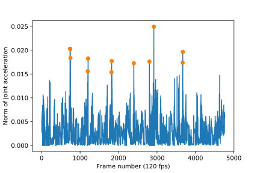

# fairmotion

fairmotion provides easy-to-use interfaces and tools to work with motion capture data. The objective of the library is to manage the complexity of motion representation, 3D transformations, file formats and visualization, and let users focus on high level learning tasks. 

Users can take advantage of large high-quality motion capture datasets like the [CMU](http://mocap.cs.cmu.edu/) and [AMASS](https://amass.is.tue.mpg.de/) datasets without deep knowledge of the domain or handling the idiosyncrasies of individual datasets. We implement baselines for research tasks using building blocks from the library to demonstrate its utility.


## Getting Started

### Installation

To install fairmotion, first clone the git repository. Use the pip tool to install the project.
```
$ git clone https://github.com/fairinternal/fairmotion.git
$ cd fairmotion
$ pip install -e .
```
### Data Loading

Here, we load a motion capture file in the BVH file format in a python console. Similarly, there are loaders to import files from ASF/AMC, AMASS and AMASS DIP formats.
```
from fairmotion.data import bvh

BVH_FILENAME = “PATH_TO_BVH_FILE”
motion = bvh.load(BVH_FILENAME)
```
### Motion manipulation

The motion object can be manipulated in both modular and matrix forms. Here, we translate the object to a fixed global position `[1, 1, 1]` and select a time slice from frame `20` to frame `30`.
```
from mocap_proceessing.processing import operations

translated_motion = operations.translate(motion, np.array([1, 1, 1]))
sliced_motion = operations.cut(translated_motion, 10, 20)
```
We can perform the same operations in the matrix representation of motion.
```
from fairmotion.motion.motion import Motion

# motion_matrix has shape (num_frames, num_joints, 4, 4) where 4x4 is transformation matrix
motion_matrix = motion.to_matrix()

translation_matrix = np.zeros((4, 4))
translation_matrix[3, :3] = np.array([1, 1, 1])

translated_motion_matrix = motion_matrix + translation_matrix
sliced_motion_matrix = translated_motion_matrix[10:20]
sliced_motion = Motion.from_matrix(sliced_motion_matrix, motion.skel)
```
### Data saving

We can save the manipulated motion object back into the bvh file format for us to visualize the result.
```
NEW_BVH_FILENAME = "PATH_TO_NEW_BVH_FILE"
bvh.save(sliced_motion, NEW_BVH_FILENAME)
```
### Visualization

We visualize the results using the bvh_visualizer tool.
```
$ python fairmotion/viz/bvh_visualizer.py --bvh-files $NEW_BVH_FILENAME
```

## Tasks
The `tasks` module showcases practical usages of the motion classes, models and visualization tools. Below, we list tasks that have been used in different projects. They build the basic infrastructure to enable incremental addition of more features. 

### Motion Prediction

Motion prediction is the problem of forecasting future body poses given observed pose sequence. Specifically, we use 2 seconds of motion as observed sequence, and attempt to predict the next second of motion. We implement a preprocessing pipeline to load motion from dataset, slice them into source and target sequences, convert to preferred angle format, and normalize data. The training code implements RNN, transformer and seq2seq models. The evaluation module reports prediction error and post-processes the resultsback to motion objects for visualization.

### Motion Graph

Motion graphs are used to create arbitrary motion sequences by combining fragments of sequences from a large dataset of motion clips. Our implementation loads a dataset of motion sequences, and construct a directed motion graph. In the graph, we construct an edge between two motion sequences if the tail of the first is similar to the head of the second. Motion can be generated simply by building walks on the graph.

### Clustering of motion capture dataset
In this task, we semantically cluster motion sequences from a large motion capture dataset, specifically the [AMASS dataset](http://amass.is.tue.mpg.de/). We implement two quick methods to generate features for sequences -- the first based on [joint heuristics](https://dl.acm.org/doi/10.1145/1073204.1073247) and the second based on [kinetic energy](https://www.researchgate.net/publication/251419971_FMDistance_A_fast_and_effective_distance_function_for_motion_capture_data) and acceleration of joints. We cluster the features using KMeans and Hierarchical approaches and visualize their t-SNE embeddings.


t-SNE embeddings of sequences from AMASS CMU dataset; 8 clusters formed by k-means clustering

### Changepoint detection
We implement an acceleration based changepoint detection algorithm in `fairmotion/tasks/changepoint_detection`.



## License
fairmotion is MIT licensed. See the LICENSE file for details.
